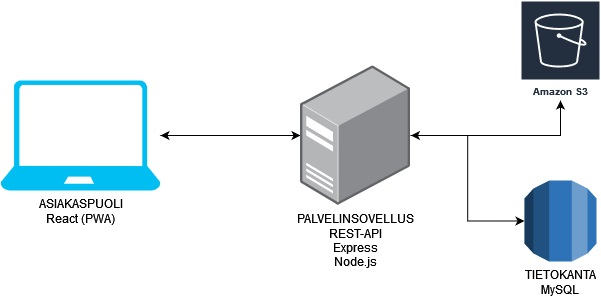
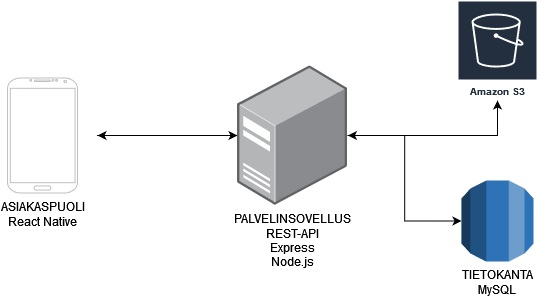

# Esitutkimus 0.7.1

- [Esitutkimus](#esitutkimus)
  - [Projektin tiedot](#projektin-tiedot)
    - [Termit ja lyhenteet](#termit-ja-lyhenteet)
    - [Viitteet](#viitteet)
  - [Johdanto](#johdanto)
  - [Visio](#visio)
  - [Käyttäjäkertomukset](#k%C3%A4ytt%C3%A4j%C3%A4kertomukset)
  - [Tekniset vaatimukset](#tekniset-vaatimukset)
  - [Ratkaisuvaihtoehdot](#ratkaisuvaihtoehdot)
    - [Ratkaisuvaihtoehto 1](#ratkaisuvaihtoehto-1)
    - [Ratkaisuvaihtoehto 2](#ratkaisuvaihtoehto-2)
  - [Yhteenveto](#yhteenveto)

## Projektin tiedot

Työnimi: Reseptipankki (ent. Äänikeittokirja)

Tekijät: Ville Kuusela, Toni Hiidenvuo, Ilmari Metsävainio, Toni Luomala

Visiomme on luoda yksinkertainen sovellusmuotoinen ratkaisu tallettaa kaikki suosikkireseptit yhteen paikkaan.

### Termit ja lyhenteet

_Esimerkiksi:_

| Termi | Kuvaus |
|---|---|
GIT | Versionhallintajärjestelmä
GitHub | Palvelu joka on rakennettu GIT versionhallinnan ympärille
Markdown | Merkkauskieli

### Viitteet

| Viittaus | Materiaali |
|---|---|
Projektisuunnitelma | https://github.com/jamktiko/reseptipankki/blob/main/Asiakirjat/projektisuunnitelma.md
HLTP | linkki tulossa

## Johdanto

Tämän dokumentin tarkoituksena on tuottaa esitutkimus Reseptipankki-sovellukselle. Kyseessä on mobiilisovellus, johon on helppo kirjoittaa, kopioida ja skannata reseptejä. Yksi sovelluksen ominaisuuksista on reseptien ääniohjaus; sovellus lukee niitä ääneen text-to-speech -teknologialla, ja käyttäjä pystyy ohjaamaan reseptin lukemisen etenemistä äänikomennoilla.

Esitutkimuksessa käydään läpi sovelluksen käyttäjäkertomukset, tekniset vaatimukset ja erilaiset ratkaisuvaihtoehdot.

## Visio

Sovelluksemme tarjoaa vaivattoman ja uniikin tavan tuoda reseptit jokaisesta lähteestä yhteen paikkaan. Nettisivuilta löydetyt reseptit voidaan helposti kopioida linkin avulla, fyysisessä muodossa olevat reseptit voidaan skannata laitteen kameralla, tai kaikki reseptit voidaan lisätä myös manuaalisesti, intuitiivisella tavalla.

"Kaikkien reseptien uusi koti"

## Käyttäjäkertomukset

1. Käyttäjä haluaa lisätä fyysisen keittokirjastansa reseptin sovellukseen. Hyväksymiskriteeri: Käyttäjä voi ottaa sovelluksessa kuvan reseptistä, ja tätä kautta lisätä sen omiin resepteihinsä.
2. Käyttäjä haluaa lisätä netistä löytämänsä reseptin sovellukseen. Hyväksymiskriteeri: Käyttäjä voi liittää reseptin url-osoitteen sovellukseen, ja sovellus ja hakee reseptin sivulta ja laittaa sen oikeaan muotoon.
3. Käyttäjä haluaa kirjoittaa juuri itse keksimänsä reseptin sovellukseen. Hyväksymiskriteeri: Käyttäjä voi kirjoittaa reseptinsä nimen, ainekset ja vaiheet sovelluksessa manuaalisesti ja lisätä reseptin siten.
4. Käyttäjä haluaa luoda listan, johon hän voi tallettaa tietyn kategorian reseptit. Hyväksymiskriteeri: Listan luominen onnistuu, ja sille voidaan lisätä reseptejä.
5. Käyttäjä haluaa muokata luomaansa listaa tai poistaa sen. Hyväksymiskriteeri: Listoilla on muokkausnäkymä, josta niitä voi muokata tai poistaa.
6. Käyttäjä haluaa muokata luomaansa reseptiä tai poistaa sen. Hyväksymiskriteeri: Resepteillä on muokkausnäkymä, josta niitä voi muokata tai poistaa.
7. Erikoisruokavaliota noudattava käyttäjä ei halua, että sovelluksensa etusivulla hänelle suositellaan liharuokia. Hyväksymiskriteeri: Käyttäjä voi sovelluksen asetuksissa asettaa erikoisruokavalionsa, jolloin hänen erikoisruokavalioonsa kuulumattomia reseptejä ei enää suositella hänelle.
8. Käyttäjä haluaa käyttää ääniominaisuuksia ruokaa laittaessaan. Hyväksymiskriteeri: Äänentunnistus tunnistaa ja ymmärtää käyttäjän sanat ruoanlaiton taustaäänien seasta, ja sovellus lukee reseptin kohtia käyttäjän komentojen mukaan.

## Tekniset vaatimukset

- Täyttää PWA-sovelluksen vaatimukset
- Sovellus toimii Firefoxin, Chromen ja Safarin nykyisillä versioilla
- Reseptin kopiointi netistä kestää enintään 5 sekuntia
- Ääniohjauksen pitää reagoida käyttäjän puheeseen 2 sekunnissa
- Toimii vähintään Android 10 ja iOs 12 -versioilla
- Sovellus käyttää TLS/SSL-salausta
- Käyttäjien salasanat ovat kryptattuina tietokannassa
- Sovelluksen värit ovat selkeitä myös värisokeille (Lighthouse-raportti)

## Ratkaisuvaihtoehdot

### Ratkaisuvaihtoehto 1

#### Toteutusympäristö

Luomme PWA-sovelluksen käyttäen Reactia. Valmiin sovelluksen muunnamme Google Play -kaupasta ladattavaan muotoon. Backend toteutetaan Expressillä.

#### Toteutettavat kertomukset

Kaikki käyttäjäkertomukset ovat toteutettavissa tässä ratkaisuvaihtoehdossa.

#### Työmääräarviot

| Vaihe | Tunnit | Muuta?
|---|---|---|
Suunnittelu | 200 | 
Koodaus | 600 | 
Testaus | 100 | 
Bisnes | 100 | Kaikki TikoBiz-asiat
Muu | 400 | Palaverit, kahvitauot, uuden opettelu yms.
**Yht** | 1400 | 

#### Plussat ja miinukset

Plussat:

+ Kahdesta vaihtoehdosta tutumpi ja helpommin kehitettävä ratkaisu
+ Toimivuus on varmempaa kaikilla alustoilla
+ Voidaan halutessamme käyttää myös nettisivuna
+ SEO-ystävällisempi

Miinukset:

- Valmiin sovelluksen buildaus haastavampaa kuin natiivilla

### Ratkaisuvaihtoehto 2

#### Toteutusympäristö

Luomme natiivisovelluksen käyttäen React Nativea.

#### Toteutettavat kertomukset

Emme ole varmoja, toimiiko se ääniohjausratkaisu, jota olemme harkinneet, natiivisovelluksessa. Muuten käyttäjäkertomukset ovat toteutettavissa.

#### Työmääräarviot

| Vaihe | Tunnit | Muuta?
|---|---|---|
Suunnittelu | 100 | 
Koodaus | 650 | 
Testaus | 100 | 
Bisnes | 100 | Kaikki TikoBiz-asiat
Muu | 450 | Palaverit, kahvitauot, uuden opettelu yms.
**Yht** | 1400 | 

#### Plussat ja miinukset

Plussat:

- Mahdollisesti tehokkaampi sovellus
- Mahdollisesti parempi visuaalinen ilme ja UI/UX

Miinukset:

- Natiivisovellusten kehittäminen (esim. Android Studiolla) vaatii tehokkaita tietokoneita, tehokkaampia kuin mitä osalla meistä on.
- Natiivisovellusten kehittäminen vaatii enemmän uuden opettelua verrattuna PWA:han.

## Yhteenveto

Sovellus toteutetaan käyttäen ratkaisuvaihtoehtoa 1, koska PWA-sovellus on meille tutumpi vaihtoehto, ja siinä on muutenkin enemmän hyötyjä natiivisovellukseen verrattaessa.
